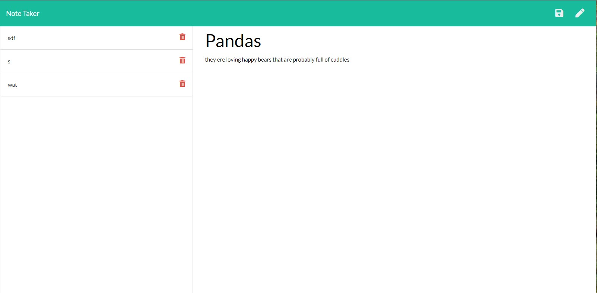

# NoteTakin

A application that will save notes for the user. a way to retrain those important moments.

## Table of Contents

[Installation](#installation)  
[Usage](#usage)  
[Contributions](#contribution)  
[Tests](#test)  
[License](#license)  
[Questions](#questions)  

## <h2 id="installation">Installation Instructions</h2>

    npm i express

## <h2 id="usage">Usage</h2>

we would wantto be able to save important information that comes up. this allows us to do so

## <h2 id="contribution">Contributions</h2>

pull are very welcomed for improvements

## <h2 id="test">Test Instructions</h2>

none

## <h2 id="license"> License</h2>

## <h2 id="questions"> Questions </h2>

    Any questions please contact me at

[Github](https://github.com/Tevvels)
or at email:chrisbwatkins@gmail.com

